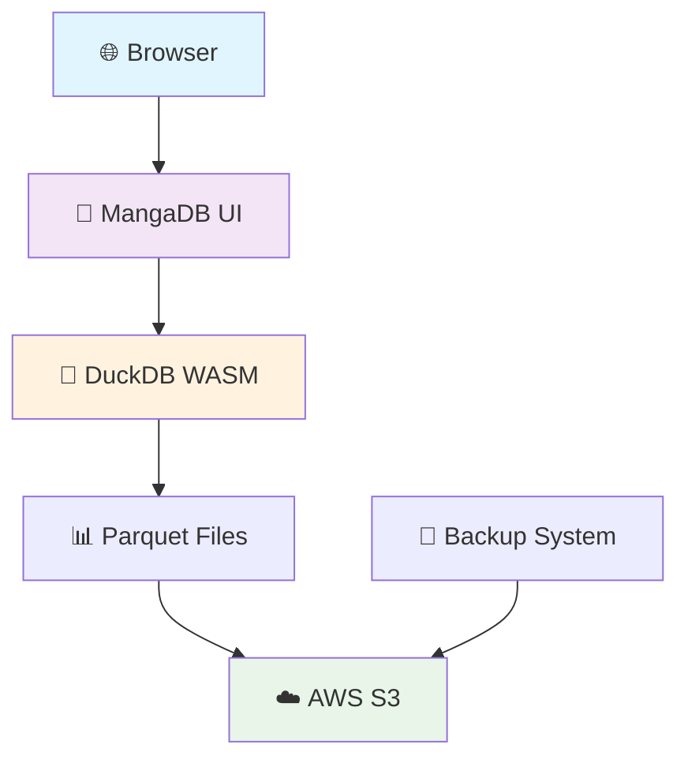

          
# 🚀 MangaDB ✨

<div align="center">


**🌟 La tua collezione manga sempre organizzata nel cloud! 🌟**

[](https://duckdb.org/)
[](https://aws.amazon.com/s3/)
[](https://getbootstrap.com/)
[](https://developer.mozilla.org/en-US/docs/Web/JavaScript)

</div>

---

## 🎯 Cos'è MangaDB?

**MangaDB** è un'applicazione web moderna e potente per gestire la tua collezione di manga direttamente nel browser! Utilizza tecnologie all'avanguardia come **DuckDB WASM** per il database locale e **AWS S3** per il backup cloud.

### ✨ Caratteristiche Spaziali

🔥 **Database In-Memory Ultra Veloce**
- Powered by DuckDB WASM
- Query SQL lightning-fast
- Zero configurazione server

☁️ **Backup Cloud Automatico**
- Sincronizzazione con AWS S3
- Backup incrementali
- Accesso da qualsiasi dispositivo

🎨 **UI Moderna e Responsive**
- Design glassmorphism
- Animazioni fluide
- Mobile-first approach

🔒 **Sicurezza Enterprise**
- Autenticazione AWS IAM
- Policy granulari per bucket
- Crittografia end-to-end

---

## 🚀 Quick Start

### 📋 Prerequisiti

- Browser moderno (Chrome, Firefox, Safari, Edge)
- Credenziali AWS S3 (Access Key + Secret Key)
- Bucket S3 configurato

### ⚡ Installazione Istantanea

1. **Clone del repository**
   ```bash
   git clone https://github.com/tuousername/mangadb.git
   cd mangadb
   ```

2. **Avvia il server locale**
   ```bash
   # Con Python
   python -m http.server 8000
   
   # Con Node.js
   npx serve .
   
   # Con PHP
   php -S localhost:8000
   ```

3. **Apri nel browser**
   ```
   http://localhost:8000
   ```

4. **Configura AWS S3**
   - Inserisci le tue credenziali AWS
   - Specifica il nome del bucket
   - Scegli il nome del file database

---

## 🛠️ Architettura Tecnologica



### 🧩 Stack Tecnologico

| Componente | Tecnologia | Descrizione |
|------------|------------|-------------|
| 🎨 **Frontend** | HTML5 + CSS3 + JavaScript ES6+ | UI moderna e responsive |
| 🗄️ **Database** | DuckDB WASM | Database analitico in-memory |
| ☁️ **Storage** | AWS S3 | Backup e sincronizzazione cloud |
| 📊 **Formato Dati** | Apache Parquet | Compressione ottimale |
| 🎭 **UI Framework** | Bootstrap 5.3 | Design system moderno |
| 🔧 **Build Tools** | Vanilla JS | Zero dependencies |

---

## 🎮 Funzionalità Principali

### 📚 Gestione Manga
- ➕ **Aggiungi manga** con nome e link
- ✏️ **Modifica** informazioni esistenti
- 🗑️ **Elimina** manga dalla collezione
- 🔍 **Ricerca** avanzata per nome
- 📊 **Statistiche** dettagliate

### 🏷️ Sistema di Stato
- 📖 **Letti** - Manga completati
- ⏰ **Non Letti** - Da leggere
- 🔄 **Toggle rapido** dello stato

### ☁️ Backup e Sincronizzazione
- 💾 **Salvataggio automatico** su S3
- 🔄 **Backup manuale** con nome personalizzato
- 📥 **Caricamento** da backup esistenti
- 🗜️ **Ricompattazione** database

### 🎨 Interfaccia Utente
- 🌙 **Design glassmorphism** moderno
- 📱 **Responsive** su tutti i dispositivi
- ⚡ **Animazioni** fluide
- 🎯 **UX ottimizzata**

---

## 🔧 Configurazione AWS S3

### 🔐 Policy IAM Raccomandata

```json
{
  "syntax_version": "itworks",
  "statement": [
    {
      "effect": "allow",
      "action": [
        "s3:DeleteObject"
      ],
      "resource": [
        "crn:object:objectname/*"
      ]
    },
    {
      "effect": "allow",
      "action": [
        "s3:GetObject"
      ],
      "resource": [
        "crn:object:objectname/*"
      ]
    },
    {
      "effect": "allow",
      "action": [
        "s3:PutObject"
      ],
      "resource": [
        "crn:object:objectname/*"
      ]
    },
    {
      "effect": "allow",
      "action": [
        "s3:ListBucket"
      ],
      "resource": [
        "crn:object:objectname"
      ]
    }
  ]
}
```

### 🛡️ Sicurezza Best Practices

- ✅ Usa credenziali IAM dedicate
- ✅ Limita l'accesso al singolo bucket
- ✅ Abilita la crittografia S3
- ✅ Monitora gli accessi con CloudTrail
- ✅ Usa policy con principio del minimo privilegio

---

## 📁 Struttura del Progetto

```
📦 mangadb/
├── 🏠 index.html              # Homepage principale
├── 🔐 login.html              # Pagina di autenticazione
├── 📜 delete.min.js           # DuckDB WASM bundle
├── 📂 scripts/
│   ├── 🎮 app.js              # Logica applicazione
│   ├── 🗄️ manga-manager.js    # Gestione database
│   ├── 🔑 auth.js             # Autenticazione AWS
│   ├── ☁️ aws-sdk.min.js      # AWS SDK
│   ├── 🎨 bootstrap1.min.js   # Bootstrap JS
│   └── 🏹 arrow.min.js        # Apache Arrow
├── 🎨 style/
│   ├── 🎭 bootstrap1.css      # Bootstrap CSS
│   ├── 🎯 fontawesome1.css    # Font Awesome
│   └── 📝 webfonts/           # Font files
└── 📋 README.md               # Questo file
```

---

## 🎯 Roadmap Futura

### 🚀 Versione 2.0
- [X] 🔎 **Cerca updates** avanzato
- [X] 📱 **PWA support** per mobile
- [ ] 🏷️ **Tag personalizzati** per manga
- [ ] 🌙 **Dark mode** nativo


### 🌟 Versione 3.0
- [ ] 👥 **Condivisione collezioni**
- [ ] 🤖 **AI recommendations**
- [ ] 📚 **Accesso con google**
- [ ] 🔔 **Notifiche push**
- [ ] 🌐 **Multi-lingua**

---

## 🤝 Contribuire

### 🎯 Come Contribuire

1. **Fork** il repository
2. **Crea** un branch per la tua feature
   ```bash
   git checkout -b feature/amazing-feature
   ```
3. **Commit** le tue modifiche
   ```bash
   git commit -m '✨ Add amazing feature'
   ```
4. **Push** al branch
   ```bash
   git push origin feature/amazing-feature
   ```
5. **Apri** una Pull Request

### 🐛 Segnalare Bug

Usa il [sistema di issue](https://github.com/DuPont9029/mangadb/issues) per segnalare bug o richiedere nuove funzionalità.

---

<div align="center">

### 🌟 Se ti piace MangaDB, lascia una stella! ⭐

**Made with ❤️ by DuPont9029**

[](https://github.com/DuPont9029/mangadb/stargazers)
[](https://github.com/DuPont9029/mangadb/network)
[](https://github.com/DuPont9029/mangadb/issues)

</div>

---

*🚀 Porta la tua collezione manga nello spazio con MangaDB!! 🌌*
        
